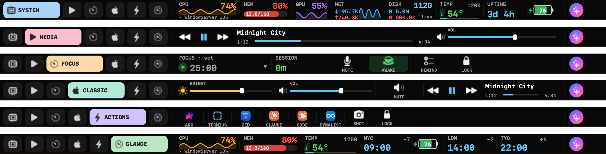
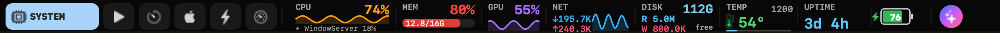
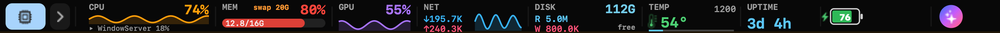

# PulseBar — an advanced, interactive Touch Bar for macOS

A **native macOS** menu-bar agent that takes over the Touch Bar — **regardless of
which app is focused** — and turns it into a live system monitor *and* a control
surface you can actually press.



## Why

Apple shipped the Touch Bar with a good idea and a timid execution. The public
`NSTouchBar` API is **focus-bound**: the strip only ever shows whatever the
*frontmost* app chooses to put there — usually chrome you didn't ask for — and
there's no first-class way to make it a **persistent, glanceable** surface. So
most people ignored it, and Apple quietly dropped it. The hardware deserved
better.

PulseBar is a different take on the same strip. Instead of per-app buttons that
vanish when you switch windows, it presents **one always-on bar that you own
across every app** — a live readout of your machine *and* a set of controls you
can actually press. It's the way the Touch Bar should have worked out of the box.

And it's **light**. PulseBar is a native AppKit agent built and tuned for
**Apple Silicon (M1)**: an AppKit-free tile model, a cached size-aware packing
engine, and once-a-second sampling mean it lives in the menu bar on a tiny CPU
and memory budget. No Electron, no helper farm, no background hogs. In practice
that's **~2% CPU and ~47 MB of RAM** on an M1 — a true background citizen.

```
[ SYSTEM | ♪ | ⏱ | ◐ | ⚡ | ◉ ]  ◀ active mode panel (animates open) ▶   …always: agent orb ●
  └ accordion mode tabs: the active one expands with a label; tap to switch (content cross-fades)
```

## Modes (animated accordion)

Tap a tab on the left to switch modes — the active tab expands (the "accordion"),
the panel cross-fades, and your choice is remembered. The agent orb stays pinned
on the right in every mode; the clock and ⚙ settings live in the menu bar.

| Mode | Contents |
|------|----------|
| **System**  | CPU · MEM · GPU · NET · DISK · **temp/fan** · uptime/session · battery |
| **Media**   | now-playing transport (◀ ⏯ ▶) · scrubber (tap to seek) · volume |
| **Focus**   | adaptive Pomodoro · **session** · voice side-note (hold to talk) · ☕ caffeine · Reminder · Lock |
| **Classic** | brightness · volume · media (the Control-Strip basics) |
| **Actions** | colourful app launcher (Arc · Termius · Zed · Claude · Claude Code · Dynalist) · Screenshot · Lock |
| **Glance**  | at-a-glance dashboard: CPU · MEM · temp/fan · **world clocks** (NYC · London · Tokyo by default) · battery |

**Tap a metric tile to cycle its view** (dynamic ↔ fundamental): CPU sparkline↔cores,
MEM usage↔pressure/swap, GPU spark↔bar, NET rates↔readout, DISK rates↔space,
and the uptime chip toggles **uptime ↔ session**.

## Tiles

**Metrics (glanceable):**
- **CPU** — % + sparkline + the current **top CPU process**. *Tap* for a per-core view (P + E cores).
- **MEM** — used / total GB + gauge (active + wired + compressed); shows **swap** when memory spills over.
- **GPU** — utilisation % + sparkline (IOAccelerator).
- **NET** — live ↓ / ↑ throughput + sparkline.
- **DISK** — read/write I/O + free space.
- **TEMP** — CPU die temperature (°C, green→amber→red ramp) + fan RPM. On Apple Silicon the temps come from the IOHIDEventSystemClient thermal sensors (not the SMC); fans from AppleSMC.
- **World Clock** — any city from a master list, **DST/summer-time correct**, with a live ±offset vs. local and a next/prev-day badge. Add several; mix into any mode.

**Controls (tap / drag):** Now Playing (MediaRemote) · Volume (CoreAudio) · Brightness
(DisplayServices) · Pomodoro · **⚙ Settings** (opens a real desktop window) · BATT / CLOCK.

## Layout profiles (composable & ✕-aware)

macOS sometimes shows a close box (✕) that shoves the bar right. Every layout
**profile** reserves room for it so the agent orb on the right stays visible. Switch
with one tap from the menu, or fine-tune any tile in the editor.

| | |
|---|---|
| **Default** — auto density, full mode tabs (the everyday layout, applied on first run) |  |
| **Minimum** — same ✕-aware margins, but icon-only tiles + a collapsed tab strip for maximum tile room |  |

Widgets are **composable per mode**: add a world clock, an app launcher, or any
tile to any mode via the in-app editor — the same tile can live in several modes.
The packing engine caches its work, so none of it costs a frame.

## Quietly smart
- **Adaptive Pomodoro** — the focus timer's length adapts to how long you've actually been working: **25 min + 5 for every 30 min** of uninterrupted session, clamped 20–50.
- **Voice side-notes** — hold the NOTE tile in Focus and just talk (walkie-talkie); captured on-device to `~/Library/Logs/PulseBar/notes.jsonl`, exportable to CSV.
- **On-device agent** — *Ask the Agent* by text or push-to-talk; it runs a local model (Ollama / Gemma) and dispatches safe actions, no cloud round-trip.
- **Per-app auto-switch** — pair apps with modes (Xcode → System, Music → Media); off by default, fully configurable.
- **Modifier shortcuts** — hold a modifier to peek your previous mode or pop an app-actions overlay; pick which key does what.
- **Desktop mirror** — a floating, clickable copy of the bar on your desktop (handy on any Mac, and a live preview while you tweak the fit).

## Settings & menu

The `▦` menu-bar icon keeps only the everyday things — **Ask the Agent**, a
**Layout** switch (Default / Minimum / Customize…), **Lock Screen**, **Settings**,
**Quit**. Everything else lives in the sectioned **Settings** window: General ·
Layout (+ profiles) · Shortcuts · Auto-Switch · Focus · Agent · Diagnostics · Notes.

## How "full bar regardless of focus" works

The public `NSTouchBar` API is focus-bound; to own the bar persistently PulseBar
uses the same private SPI as Pock / MTMR / BetterTouchTool — all verified at
runtime on the build machine before use:
- `DFRFoundation` control-strip presence + `presentSystemModalTouchBar:placement:` (focus-independent; `placement:1` hides the Control Strip natively) + `DFRSystemModalShowsCloseBoxWhenFrontMost(NO)` (suppress the ✕)
- `DisplayServices` brightness, `MediaRemote` now-playing/transport, CoreAudio volume

> ⚠️ Private API → **not App-Store-shippable; Touch Bar Macs only.** Built & tested on a
> MacBook Pro (M1 13″, macOS 15.6). Guarded so it degrades to a menu-bar item where
> the SPI is missing.

## Build · Run · Test

```bash
./build.sh             # → build/PulseBar.app (ad-hoc signed) + bare binary
./run.command          # build-if-needed, then launch
./tests/run_tests.sh   # unit tests (all samplers) + smoke test (presents bar, clean exit)
```
There's also `tests/render_test.m`, which renders the bar to PNGs so the layout can
be inspected without a physical Touch Bar (the website's screenshots come from it).

Runs as a background **accessory app** (no Dock icon; `▦` menu-bar icon). Quit via the
menu-bar icon → **Quit PulseBar** (or `pkill -x PulseBar`).

## Source map

```
Sources/
  main.m · AppDelegate.m       accessory app · SPI presentation · 1 Hz sampling · actions · full-bar
  BarView.m                    interactive tile rendering + hit-testing (drives the PBLayout engine)
  PBLayout.m                   AppKit-free tile model + size-aware packing + per-mode composition + profiles
  PBClock.m · PBThermal.m      world-clock master list (DST-correct) · CPU temp + fan RPM
  Stats.m · Controls.m         cpu/mem/net/gpu/disk/battery · volume·brightness·media
  Pomodoro.m · VoiceNotes.m    work/break timer · Focus side-notes (walkie-talkie)
  TouchBarPresenter.m          Touch Bar SPI: present/dismiss + reversible full-bar takeover
  MirrorController.m           desktop mirror panel (floating, clickable copy)
  AgentCoordinator.m · Agent.m on-device agent · chat/voice window · safe action dispatch
  SettingsWindowController.m   sectioned settings window
  LayoutEditorWindowController.m  per-tile editor: size/priority/visibility/order + add/remove
```

A polished overview lives in [`site/index.html`](site/index.html) (open it in a browser).

## Author

Built by **Alexey Abramov** — [www.alexeyabramov.com](https://www.alexeyabramov.com).

## License

Licensed under the **GNU Affero General Public License v3.0** (AGPL-3.0) — see
[`LICENSE`](LICENSE). In short: you're free to use, study, modify, and share it,
but if you distribute it **or run a modified version as a network service**, you
must make your source available under the same license.
